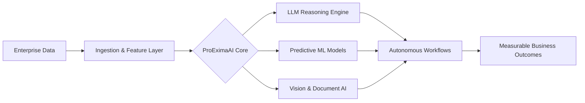

<div align="center">


<a href="https://proeximaai.com">

</a>

<br/>


</div>

---

```console
$ whoami --verbose

┌─ IDENTITY ──────────────────────────────────────────────────────────┐
│  name        : Pritish Kumar Ray                                    │
│  role        : Founder & CEO — ProEximaAI Products & Solutions      │
│  focus       : Applied AI · LLM Systems · Enterprise Engineering    │
│  mission     : Turn frontier research into production-grade systems │
│  status      : ONLINE ▸ shipping                                    │
└─────────────────────────────────────────────────────────────────────┘
```

---

## ◈ Command Center

<table>
<tr>
<td width="50%" valign="top">

### 🚀 ProEximaAI — Founder & CEO
AI-first products and consulting for enterprises that need to automate, scale, and think faster.

`Autonomous Agents` `LLMOps` `Data Platforms`

</td>
<td width="50%" valign="top">

### 🎓 IIT Patna — Resource Person
AI/ML integration in digital marketing. Predictive analytics, recommender systems, NLP content intelligence.

`Teaching` `Curriculum` `Applied ML`

</td>
</tr>
<tr>
<td width="50%" valign="top">

### 🔬 DataLet Research Lab — Project Head
Leading applied research that closes the gap between published papers and deployed systems.

`Research` `Model Dev` `Benchmarking`

</td>
<td width="50%" valign="top">

### 💻 Industry Practice — Software Engineer
Distributed backends, high-throughput services, and the unglamorous plumbing that makes AI usable.

`Spring Boot` `.NET` `Microservices`

</td>
</tr>
</table>

---

## ◈ ProEximaAI — Intelligence, Productized

> **[proeximaai.com](https://proeximaai.com)**



| Pillar | What We Build |
|:--|:--|
| 🤖 **Automation** | Agentic workflows that replace manual operational loops |
| 📊 **Marketing Intelligence** | Attribution, personalization, and predictive campaign engines |
| 🧠 **LLM Integration** | RAG pipelines, fine-tuning, evaluation harnesses, guardrails |
| ⚙️ **Product Engineering** | Full-stack systems built to survive real traffic |

---

## ◈ Tech Arsenal

<div align="center">

**◤ LANGUAGES ◢**


**◤ FRAMEWORKS & PLATFORMS ◢**


</div>

```yaml
ai_ml_domains:
  machine_learning:  [supervised, unsupervised, hyperparameter_optimization, ensembles]
  deep_learning:     [CNNs, transformers, transfer_learning, model_compression]
  nlp:               [text_classification, sentiment_analysis, RAG, LLM_orchestration]
  computer_vision:   [object_detection, segmentation, OCR, image_processing]
  ai_for_growth:     [predictive_analytics, personalization, recommender_systems]

engineering:
  backend:     [Spring Boot, Hibernate, .NET, REST, microservices]
  data:        [MySQL, SQL optimization, ETL pipelines]
  automation:  [Selenium, CI/CD, containerized deployments]
```

---

## ◈ Telemetry

<div align="center">


</div>

---

## ◈ Currently

```diff
+ Scaling ProEximaAI's agentic automation platform
+ Researching evaluation methods for production LLM systems
+ Mentoring on AI/ML deployment at IIT Patna
! Open to: research collaborations · AI consulting · strategic partnerships
```

---

## ◈ Establish Connection

<div align="center">

<a href="https://proeximaai.com"></a>
<a href="https://www.linkedin.com/in/pritishray/"></a>
<a href="https://github.com/pritishdoc"></a>
<a href="mailto:pritish.iter2022@gmail.com"></a>

<br/><br/>

> ### *"Build with purpose. Scale with intelligence. Lead with vision."*


</div>
